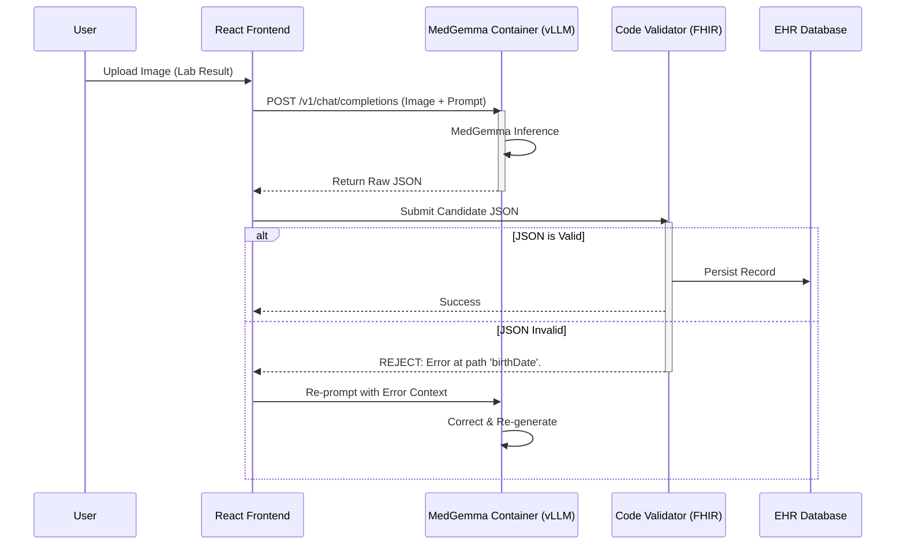

# ⚠️ WORK IN PROGRESS: DUMMY README / CONCEPT DRAFT ⚠️

> **Note:** This documentation serves as a conceptual prototype. Implementation details and architectural specifics are currently placeholders and subject to change.

# MedGemma FHIR-Bridge: Autonomous Medical Data Standardization Pipeline

[](https://opensource.org/licenses/MIT)
[-blue>)](https://kaggle.com/models/google/medgemma)
[](https://hl7.org/fhir/)
[]()

> **Submission Category:** Agentic / Edge
> **Core Innovation:** Self-Correcting "Human-in-the-Loop" Architecture running entirely on-device.
>
> 📚 **[Frontend Setup Guide](docs/frontend_setup.md)** | **[Python/Backend Setup](docs/setup.md)**

---

## Executive Summary

The **MedGemma FHIR-Bridge** is an enterprise-grade interoperability engine designed to resolve the healthcare industry's "Dark Data" crisis. It functions as a semantic bridge between unstructured analog records (handwritten progress notes, faxed lab results, legacy paper charts) and the **HL7 FHIR (Fast Healthcare Interoperability Resources)** digital standard.

By orchestrating **MedGemma 1.5 (4B)** within a recursive, deterministic validation loop, the system achieves what standard OCR cannot: **context-aware semantic structuring with guaranteed schema compliance.** This "Self-Healing" architecture allows the AI to audit its own outputs against rigid medical standards, automatically correcting hallucinations or formatting errors before data persistence.

---

## The Problem: The Interoperability Gap

Despite billions invested in EHRs, healthcare remains fragmented.

- **Dark Data:** ~90% of medical insights are trapped in unstructured formats (PDFs, images, paper).
- **Manual Bottlenecks:** Clinical staff spend hours manually transcribing data, a process prone to typo-induced medical errors.
- **Privacy Latency:** Cloud-based extraction services introduce unacceptable privacy risks (PII leakage) and latency.

## The Solution: A Self-Healing Edge Architecture

Our solution deploys a local-first, agentic pipeline that treats medical data extraction as a multi-step engineering problem rather than a simple text generation task.

### Core Architectural Components

#### 1. The "Reader" (Multimodal Ingestion via vLLM)

Leveraging **MedGemma 1.5** served via **vLLM** (high-throughput serving engine), the system ingests high-entropy inputs through a standard OpenAI-compatible API endpoint.

- _Performance:_ vLLM provides state-of-the-art serving throughput, minimizing latency for real-time edge interactions.
- _Capability:_ Differentiates between **Subjective** (narrative notes) and **Objective** (vitals, labs) data points from visual inputs.

#### 2. The "Architect" (Semantic Mapping)

Raw extractions are normalized into the FHIR R4 schema.

- _Normalization:_ Maps colloquialisms ("taken twice daily") to standard frequencies (`code: BID`).
- _Ontology Linking:_ Associates extracted terms with SNOMED CT and LOINC codes where applicable.

#### 3. The "Auditor" (The Self-Healing Engine)

**This is the project's critical innovation.** Instead of blindly trusting the LLM, we pass the output through a rigid, code-based validator (Pydantic/FHIR Models).



---

## Technical Stack

This project is engineered for **universal accessibility** and **high-performance inference**.

| Component          | Technology                | Role                                                                                |
| :----------------- | :------------------------ | :---------------------------------------------------------------------------------- |
| **Intelligence**   | **MedGemma 1.5 (4B)**     | Multimodal reasoning. Served via **vLLM** for production-grade throughput.          |
| **Serving**        | **vLLM Docker Container** | Exposes the model via an **OpenAI-compatible API**, allowing standard integrations. |
| **Interface**      | **React Frontend**        | Custom, responsive UI designed in React connecting to the model API.                |
| **Validation**     | **Python / Pydantic**     | Deterministic schema enforcement (The "Auditor").                                   |
| **Infrastructure** | **Docker**                | Encapsulates the vLLM serving engine for consistent deployment.                     |

---

## Privacy & Compliance (Hybrid Edge/Access)

While the interface is accessible via a custom React frontend for ease of use, the core inference engine (MedGemma via vLLM) can be deployed in a **private cloud or on-premise GPU server**.

- **Decoupled Architecture:** The serving layer (vLLM) is separated from the UI, allowing strict control over where the data processing actually happens.
- **Standardized API:** Using the OpenAI protocol means you can swap the UI or the backend without breaking the system.

---

## vLLM MedGemma Configuration

To serve the MedGemma 1.5 model using vLLM in a Podman container on Ubuntu, use the following configuration script. This setup ensures persistent model storage and an OpenAI-compatible API endpoint.

```bash
#!/usr/bin/env bash
set -euo pipefail

###############################################################################
# vLLM MedGemma 1.5 on Ubuntu (Podman) – OpenAI-compatible API
# - Downloads model to host dir (persistent)
# - Runs vLLM serving the local model (so rm/stop container won’t delete weights)
###############################################################################

# 1) Credentials (set your real values)
export HF_TOKEN="hf_xxxxxxxxxxxxxxxxxxxxx"
export VLLM_API_KEY="super-secret-key-change-me"

# 2) Where to store the model on the host (persistent)
MODEL_DIR="/home/compute/models/medgemma-1.5-4b-it"
mkdir -p "$MODEL_DIR"

# 3) Download model to the host (requires huggingface-cli or python + huggingface_hub)
export HUGGING_FACE_HUB_TOKEN="$HF_TOKEN"
huggingface-cli download google/medgemma-1.5-4b-it --local-dir "$MODEL_DIR"

# 4) Stop/remove old container if present (safe; model stays in MODEL_DIR)
sudo podman stop vllm-medgemma 2>/dev/null || true
sudo podman rm vllm-medgemma 2>/dev/null || true

# 5) Run vLLM serving the LOCAL model directory
sudo podman run -d --name vllm-medgemma \
  --pull=always \
  --restart always \
  --device nvidia.com/gpu=all \
  --security-opt=label=disable \
  --ipc=host \
  -p 8001:8000 \
  -v "$MODEL_DIR":/model:Z \
  -e VLLM_API_KEY="$VLLM_API_KEY" \
  -e NCCL_P2P_DISABLE=1 \
  docker.io/vllm/vllm-openai:latest \
  /model \
  --served-model-name google/medgemma-1.5-4b-it \
  --host 0.0.0.0 \
  --port 8000 \
  --dtype bfloat16 \
  --max-model-len 8192 \
  --gpu-memory-utilization 0.30 \
  --limit-mm-per-prompt '{"image": 8}'
```

---

## Datasets Used

This project utilizes the following datasets for training and validation of the prescription analysis capabilities:

1. **Bajaj Dataset**: [Link](https://www.kaggle.com/datasets/dikshaasinghhh/bajaj)
2. **Medical Prescription Dataset**: [Link](https://www.kaggle.com/datasets/bokhnhl/medical-prescription-dataset)
3. **Illegible Medical Prescription Images Dataset**: [Link](https://www.kaggle.com/datasets/mehaksingal/illegible-medical-prescription-images-dataset)

---

## Future Roadmap

- **EHR Integration:** Direct adapters for Epic and Cerner (HL7 v2 over MLLP).
- **Batch Processing:** Queue system for bulk ingestion of legacy archives.
- **Active Learning:** Optional feedback loop where clinician corrections fine-tune the local adapter (LoRA) for institution-specific handwriting.

---

_Developed for the MedGemma Impact Challenge 2025._
