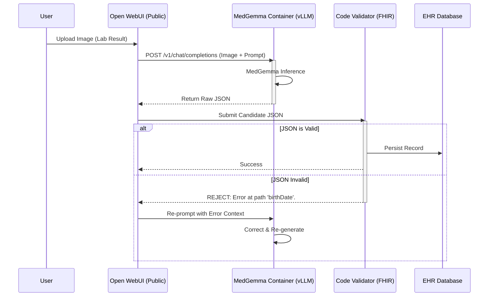

# ⚠️ WORK IN PROGRESS: DUMMY README / CONCEPT DRAFT ⚠️
> **Note:** This documentation serves as a conceptual prototype. Implementation details and architectural specifics are currently placeholders and subject to change.

# MedGemma FHIR-Bridge: Autonomous Medical Data Standardization Pipeline

[](https://opensource.org/licenses/MIT)
[-blue)](https://kaggle.com/models/google/medgemma)
[](https://hl7.org/fhir/)
[]()

> **Submission Category:** Agentic / Edge
> **Core Innovation:** Self-Correcting "Human-in-the-Loop" Architecture running entirely on-device.

---

## 📑 Executive Summary

The **MedGemma FHIR-Bridge** is an enterprise-grade interoperability engine designed to resolve the healthcare industry's "Dark Data" crisis. It functions as a semantic bridge between unstructured analog records (handwritten progress notes, faxed lab results, legacy paper charts) and the **HL7 FHIR (Fast Healthcare Interoperability Resources)** digital standard.

By orchestrating **MedGemma 1.5 (4B)** within a recursive, deterministic validation loop, the system achieves what standard OCR cannot: **context-aware semantic structuring with guaranteed schema compliance.** This "Self-Healing" architecture allows the AI to audit its own outputs against rigid medical standards, automatically correcting hallucinations or formatting errors before data persistence.

---

## 📉 The Problem: The Interoperability Gap

Despite billions invested in EHRs, healthcare remains fragmented.
*   **Dark Data:** ~90% of medical insights are trapped in unstructured formats (PDFs, images, paper).
*   **Manual Bottlenecks:** Clinical staff spend hours manually transcribing data, a process prone to typo-induced medical errors.
*   **Privacy Latency:** Cloud-based extraction services introduce unacceptable privacy risks (PII leakage) and latency.

## 💡 The Solution: A Self-Healing Edge Architecture

Our solution deploys a local-first, agentic pipeline that treats medical data extraction as a multi-step engineering problem rather than a simple text generation task.

### Core Architectural Components

#### 1. The "Reader" (Multimodal Ingestion via vLLM)
Leveraging **MedGemma 1.5** served via **vLLM** (high-throughput serving engine), the system ingests high-entropy inputs through a standard OpenAI-compatible API endpoint.
*   *Performance:* vLLM provides state-of-the-art serving throughput, minimizing latency for real-time edge interactions.
*   *Capability:* Differentiates between **Subjective** (narrative notes) and **Objective** (vitals, labs) data points from visual inputs.

#### 2. The "Architect" (Semantic Mapping)
Raw extractions are normalized into the FHIR R4 schema.
*   *Normalization:* Maps colloquialisms ("taken twice daily") to standard frequencies (`code: BID`).
*   *Ontology Linking:* Associates extracted terms with SNOMED CT and LOINC codes where applicable.

#### 3. The "Auditor" (The Self-Healing Engine)
**This is the project's critical innovation.** Instead of blindly trusting the LLM, we pass the output through a rigid, code-based validator (Pydantic/FHIR Models).



---

## 🛠️ Technical Stack

This project is engineered for **universal accessibility** and **high-performance inference**.

| Component | Technology | Role |
| :--- | :--- | :--- |
| **Intelligence** | **MedGemma 1.5 (4B)** | Multimodal reasoning. Served via **vLLM** for production-grade throughput. |
| **Serving** | **vLLM Docker Container** | Exposes the model via an **OpenAI-compatible API**, allowing standard integrations. |
| **Interface** | **Open WebUI** | Publicly hosted, responsive frontend that connects to the model API from anywhere. |
| **Validation** | **Python / Pydantic** | Deterministic schema enforcement (The "Auditor"). |
| **Infrastructure** | **Docker** | Encapsulates the vLLM serving engine for consistent deployment. |

---

## 🔒 Privacy & Compliance (Hybrid Edge/Access)

While the interface is accessible publicly via Open WebUI for ease of use, the core inference engine (MedGemma via vLLM) can be deployed in a **private cloud or on-premise GPU server**.
*   **Decoupled Architecture:** The serving layer (vLLM) is separated from the UI, allowing strict control over where the data processing actually happens.
*   **Standardized API:** Using the OpenAI protocol means you can swap the UI or the backend without breaking the system.

---

## 🚀 Getting Started

### Prerequisites
*   Docker & Docker Compose
*   NVIDIA GPU (for vLLM acceleration)

### Installation

1.  **Clone the Repository**
    ```bash
    git clone https://github.com/ALIENvsROBOT/challenge_kaggle.git
    cd challenge_kaggle
    ```

2.  **Launch the vLLM Serving Engine**
    ```bash
    # Example command to start the vLLM container
    docker run --gpus all -v ~/.cache/huggingface:/root/.cache/huggingface \
        --env "HUGGING_FACE_HUB_TOKEN=<your_token>" \
        -p 8000:8000 \
        ipc=host \
        vllm/vllm-openai:latest \
        --model google/medgemma-1.5-4b
    ```

3.  **Connect Open WebUI**
    *   Point your Open WebUI instance's API connection to your vLLM host: `http://<your-server-ip>:8000/v1`
    *   Start interacting with the "Self-Healing" agent.

---

## 🔮 Future Roadmap

*   **EHR Integration:** Direct adapters for Epic and Cerner (HL7 v2 over MLLP).
*   **Batch Processing:** Queue system for bulk ingestion of legacy archives.
*   **Active Learning:** Optional feedback loop where clinician corrections fine-tune the local adapter (LoRA) for institution-specific handwriting.

---

*Developed for the MedGemma Impact Challenge 2025.*