# MedGemma FHIR-Bridge: Autonomous Medical Data Standardization Pipeline

[](https://opensource.org/licenses/MIT)
[-blue>)](https://kaggle.com/models/google/medgemma)
[](https://hl7.org/fhir/)
[]()

> **Submission Category:** Agentic / Edge / Interoperability
> **Core Innovation:** A Multi-Image "Self-Healing" Pipeline that guarantees FHIR R4 schema compliance from unstructured evidence.

---

## Executive Summary

The **MedGemma FHIR-Bridge** is an enterprise-grade interoperability engine designed to resolve the healthcare industry's "Dark Data" crisis. It functions as a semantic bridge between unstructured analog records (handwritten scripts, prescription images, lab results) and the **HL7 FHIR (Fast Healthcare Interoperability Resources)** digital standard.

By orchestrating **MedGemma 1.5 (4B)** within a recursive validation loop, the system achieves **context-aware semantic structuring with guaranteed schema compliance.** The "Self-Healing" architecture identifies model hallucinations or formatting errors in real-time, while **Collaborative Synthesis** allows human expertise (Doctor's Notes) to guide and refine AI-generated clinical summaries (AI Insights).

---

## Key Features

- **🖼️ Collective Batch Processing**: Ingest up to 8 clinical images in a single session. The system processes them as a unified context, allowing the model to cross-reference evidence across multiple pages.
- **🧠 Multi-Modality Classification (v1.4)**: Automatically identifies the document type (Radiology report, visual Scan, handwritten Prescription, or Vitals) and switches to an optimized extraction prompt for that specific modality.
- **🔬 Smart FHIR Viewer**: A premium, split-screen verification interface. Compare original evidence side-by-side with structured data, categorized into `Vital Signs`, `Lab Results`, and `Medications`.
- **🧪 Ultra-High Precision Extraction**: Utilizes a strict **TSV Protocol** for 100% accurate extraction of complex Complete Blood Count (CBC) and Differential reports.
- **🧬 FHIR R4 Perfection**:
  - **LOINC Integration**: Automatically maps extracted tests to global terminology standards (e.g., Haemoglobin -> `718-7`).
  - **Smart-Type Logic**: Automatically switches between `valueQuantity` and `valueString` to ensure strict schema compliance.
- **🔐 Secure API Gateway (v1.3)**:
  - **Dynamic Provisioning**: Frontend clients auto-negotiate secure keys via `/api/v1/auth/register`.
  - **Database Persistence**: Keys are stored in PostgreSQL with granular role scopes and revocation capabilities.
- **� Collaborative Intelligence**:
  - **Doctor's Notes**: Reviewers can attach clinical contextual notes directly to the immutable FHIR record.
  - **AI Clinical Synthesis**: A specialized prompt engine (MedGemma) integrates the raw image evidence _and_ the doctor's notes to generate a concise, synthesized clinical summary with recommendations.
- **�🔄 Retroactive Smart Rerun**:
  - **Temporal Correction**: Re-analyze old records with updated logic.
  - **Priority Queueing**: Updated records automatically float to the top of the clinician's timeline for immediate review.
- **🛡️ Self-Healing Fallbacks**: If model output is malformed, the "Auditor" triggers a high-integrity fallback, preserving patient safety and ensuring a 100% processing success rate.
- **📊 Real-Time Analytics Dashboard**: Dynamic monitoring of active patient streams, recent activity history, and session-secure system logs.

---

## The Solution: A Self-Healing Edge Architecture

Our solution treats medical data extraction as a multi-step engineering problem rather than a simple text generation task.

### Core Architectural Components

#### 1. The "Reader" (Multimodal Ingestion via vLLM)

Leveraging **MedGemma 1.5** (4B) served via **vLLM**, the system ingests high-entropy visual inputs.

- **Multi-Image Support**: Unlike standard one-shot extraction, the bridge interleaves up to 8 images into a single prompt, providing the model with full clinical context.

#### 2. The "Architect" (LOINC Mapping & Normalization)

Raw extractions are normalized into the FHIR R4 schema.

- **Terminology Mapping**: Collocated dictionaries map raw text to formal **LOINC** and **SNOMED** codes.
- **Unit Normalization**: Standardizes colloquial units (e.g., "mill/cumm" -> "mill/mm3").

#### 3. The "Auditor" (The Innovation)

Raw LLM outputs pass through a rigid, code-based validator.

```mermaid
sequenceDiagram
    participant User
    participant UI as React Dashboard
    participant API as FastAPI Backend
    participant LLM as MedGemma vLLM
    participant DB as PostgreSQL

    User->>UI: Select 1-8 Clinical Images
    UI->>API: POST /api/v1/ingest (Batch Upload)

    rect rgb(30, 30, 40)
    Note over API, LLM: 🧠 Two-Pass Classification (v1.4)
    API->>LLM: Pass 1: Identify Modality (Classification)
    LLM-->>API: Type: [Lab | Radiograph | Prescription | Vitals]
    API->>LLM: Pass 2: specialized Extraction (TSV Protocol)
    LLM-->>API: Structured Multi-page Context
    end

    rect rgb(30, 30, 40)
    Note over API: 🛡️ Self-Healing Pipeline
    API->>API: Normalize Units & LOINC Mapping
    API->>API: Validate FHIR R4 Schema
    alt Verification Success
        API->>DB: Persist Canonical FHIR Record
    else Verification Failure
        API->>DB: Trigger & Persist Safety Fallback
    end
    end

    API-->>UI: Return Standardized FHIR Bundle
```



---

## Technical Stack

| Component        | Technology                | Role                                                       |
| :--------------- | :------------------------ | :--------------------------------------------------------- |
| **Intelligence** | **MedGemma 1.5 (4B)**     | Multimodal reasoning & extraction logic.                   |
| **Serving**      | **vLLM**                  | High-throughput OpenAI-compatible inference engine.        |
| **Backend**      | **FastAPI / Python**      | Secure API Gateway and "Self-Healing" logic.               |
| **Database**     | **PostgreSQL**            | Persistent storage of patient records and FHIR Bundles.    |
| **Frontend**     | **React 19 / Vite**       | Premium dark-mode dashboard with real-time sync.           |
| **CI/CD**        | **GitHub Actions / Ruff** | Automated Docker config validation and high-speed linting. |

---

## vLLM MedGemma Configuration

To serve the MedGemma 1.5 model using vLLM in a Podman container on Ubuntu, use the following configuration script. This setup ensures persistent model storage and an OpenAI-compatible API endpoint.

```bash
#!/usr/bin/env bash
set -euo pipefail

###############################################################################
# vLLM MedGemma 1.5 on Ubuntu (Podman) – OpenAI-compatible API
# - Downloads model to host dir (persistent)
# - Runs vLLM serving the local model (so rm/stop container won’t delete weights)
###############################################################################

# 1) Credentials (set your real values)
export HF_TOKEN="hf_xxxxxxxxxxxxxxxxxxxxx"
export VLLM_API_KEY="super-secret-key-change-me"

# 2) Where to store the model on the host (persistent)
MODEL_DIR="/home/compute/models/medgemma-1.5-4b-it"
mkdir -p "$MODEL_DIR"

# 3) Download model to the host (requires huggingface-cli or python + huggingface_hub)
export HUGGING_FACE_HUB_TOKEN="$HF_TOKEN"
huggingface-cli download google/medgemma-1.5-4b-it --local-dir "$MODEL_DIR"

# 4) Stop/remove old container if present (safe; model stays in MODEL_DIR)
sudo podman stop vllm-medgemma 2>/dev/null || true
sudo podman rm vllm-medgemma 2>/dev/null || true

# 5) Run vLLM serving the LOCAL model directory
sudo podman run -d --name vllm-medgemma \
  --pull=always \
  --restart always \
  --device nvidia.com/gpu=all \
  --security-opt=label=disable \
  --ipc=host \
  -p 8001:8000 \
  -v "$MODEL_DIR":/model:Z \
  -e VLLM_API_KEY="$VLLM_API_KEY" \
  -e NCCL_P2P_DISABLE=1 \
  docker.io/vllm/vllm-openai:latest \
  /model \
  --served-model-name "google/medgemma-1.5-4b-it" \
  --host 0.0.0.0 \
  --port 8000 \
  --dtype bfloat16 \
  --max-model-len 8192 \
  --gpu-memory-utilization 0.30 \
  --limit-mm-per-prompt '{"image": 8}' # Enables Batch Ingestion
```

---

## Future Roadmap

- **EHR Integration:** Direct adapters for HL7 v2 over MLLP.
- **Edge Deployment:** Optimization for NVIDIA Jetson devices.
- **Active Learning:** Clinician feedback loop for local handwriting LoRA adaptation.

---

_Developed for the MedGemma Impact Challenge 2025._
